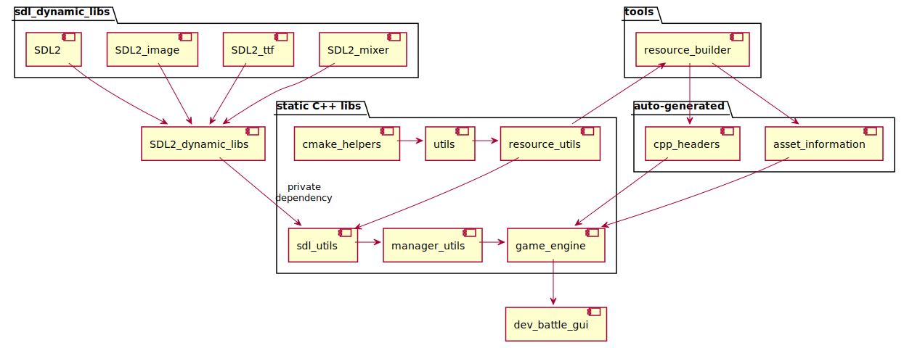

# dev_battle

## A C++ placeholder project for a future 2D GUI game

The project utilizes a personal 2D game_engine set of libraries.
A highly-configurable thread-per-component approach is used.
The project uses plain CMake and it optimized for fast compilation.

## Git submodules
This repository has it's dependencies configured as git submodules.
To clone them, step inside the repository and run the following instructions
```
git submodule init
git submodule update
```

## Supported Platforms
Linux:
  - g++ 12
  - clang++ 14
  - Emscripten (em++) 3.1.28
  - Robot Operating System 2 (ROS2)
    - Through colcon meta-build system (CMake based)
  - Robot Operating System 1 (ROS1)
    - Through catkin meta-build system (CMake based)
      - Due to soon ROS1 end-of-life catkin builds are not actively supported

Windows:
  - MSVC++ (>= 14.20) Visual Studio 2019

## CMake configuration. Building the project
Use plain CMake to configure and build the project or use some of the existing presets
```
# native build
./scripts/build/native_build.sh

# emscripten build
./scripts/build/emscripten_build.sh
```

## Automatic asset information generation
If your are manually building the project - the first build will fail, because you are missing some auto-generated headers.

Asset generation should be executed only once in the beginning.
Or everytime you modify some of the resource files (asset information descriptions)

```
./scripts/build/generate_asset_info.sh <build_dir> <asset_install_dir>

# Note: the build present scripts native_build.sh and emscripten_build.sh
# already invoke generate_asset_info.sh for you
```

## Running the project
Manually invoke the project binary or use some of the existing run presets
```
# native run
./scripts/run/native_run.sh

# emscripten run
./scripts/run/emscripten_run.sh
```

## Dependencies
- cmake_helpers - https://github.com/zhivkopetrov/cmake_helpers.git
- utils - https://github.com/zhivkopetrov/utils
- resource_utils - https://github.com/zhivkopetrov/resource_utils
- sdl_utils - https://github.com/zhivkopetrov/sdl_utils
- manager_utils - https://github.com/zhivkopetrov/manager_utils
- game_engine - https://github.com/zhivkopetrov/game_engine
- tools - https://github.com/zhivkopetrov/tools

## Third party libs, which are not shipped with this repository
- SDL2
- SDL2-image
- SDL2-ttf
- SDL2-mixer

Installing them through apt is sufficient when native builds are targeted under Linux

```
sudo apt install libsdl2-dev libsdl2-ttf-dev libsdl2-image-dev libsdl2-mixer-dev
```

For windows builds download SDL2 packages from the official repo
https://github.com/libsdl-org/SDL/releases/latest

Extract under "C:/SDL2" or alongside the project binary 

## Dependency hierarchy diagram


## Project limitations / TODOs
- Emscripten toolchain is still not imported as a dependency (Pending TODO).
Currently the build/run preset scripts rely that the emscripten repository is located under $HOME/workspace/ on your host.
For official installation refer to: https://emscripten.org/docs/getting_started/downloads.html

- Emscripten builds does not support threads.
Currently the whole engine + game are configured to run on a single thread
